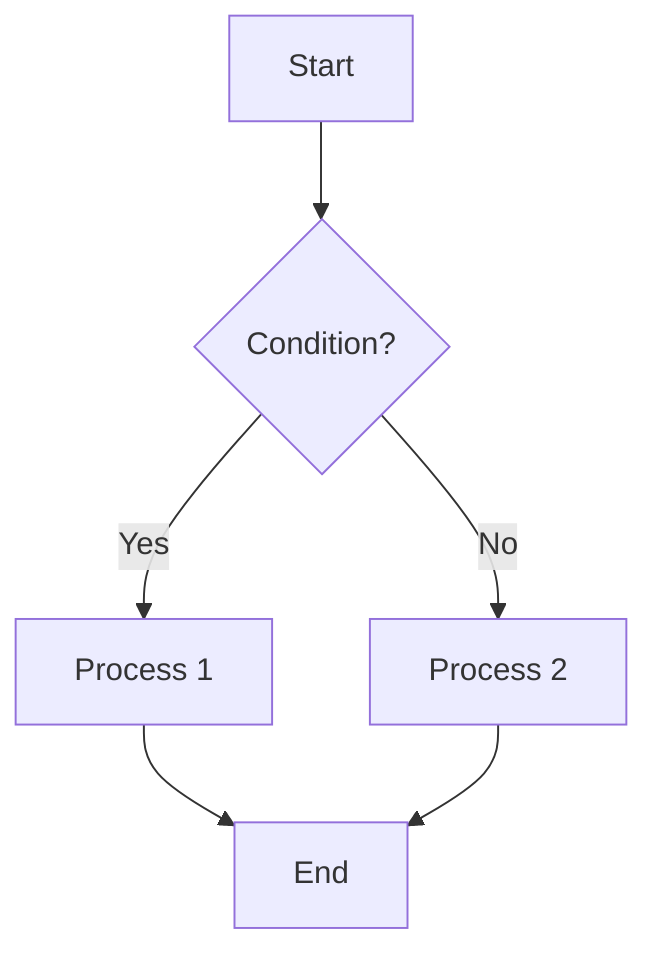
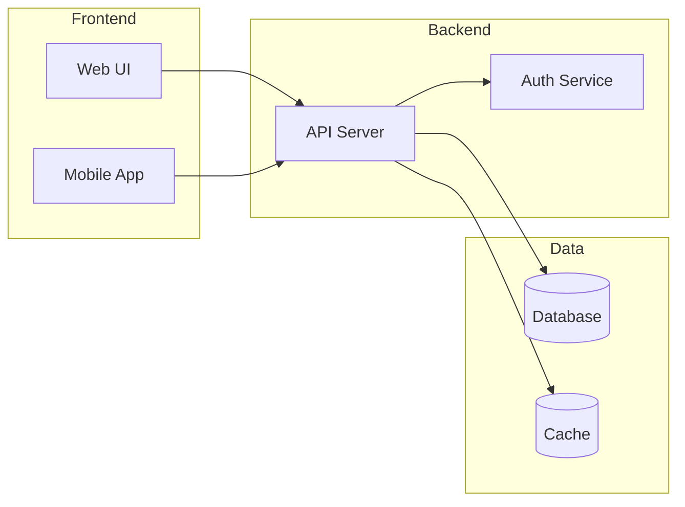
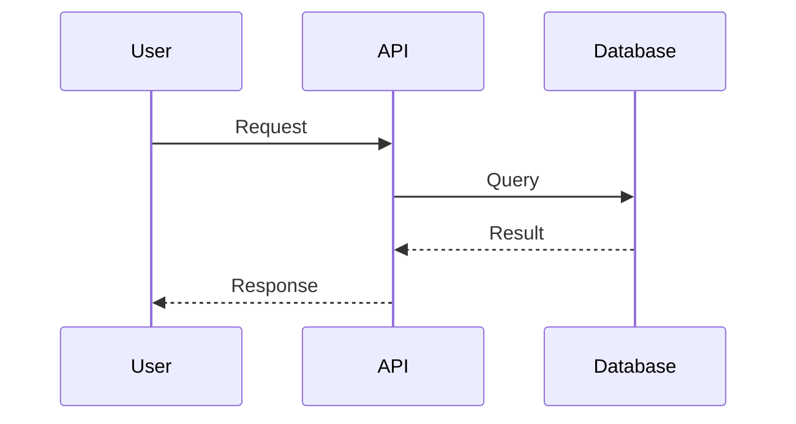
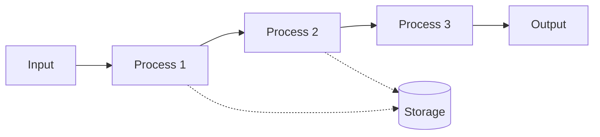
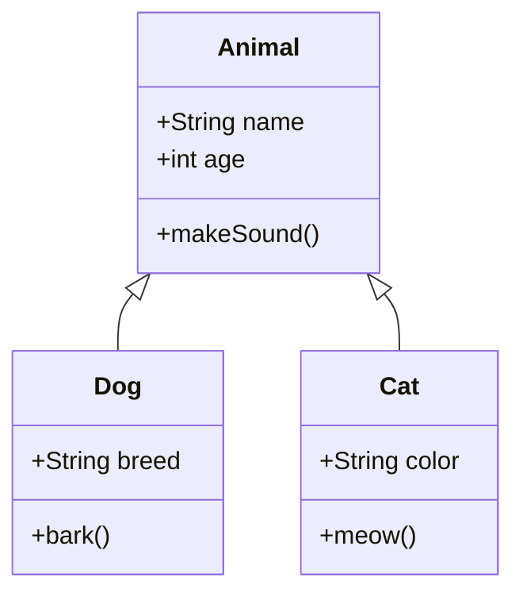
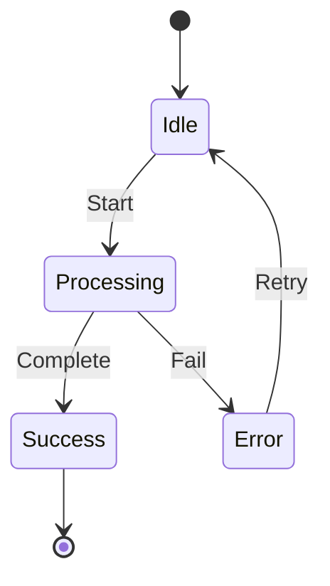

# Diagram Patterns Reference

Markdown(Mermaid)과 PDF(ASCII) 다이어그램 패턴 모음

## 1. 플로우차트 (Flowchart)

### Mermaid 버전


### ASCII 버전
```
+-------+
| Start |
+---+---+
    |
    v
+---+---+
|  ???  |
+---+---+
    |
+---+-------+
|           |
v           v
+-----+   +-----+
| P1  |   | P2  |
+--+--+   +--+--+
   |         |
   +----+----+
        |
        v
   +----+----+
   |   End   |
   +---------+
```

## 2. 시스템 아키텍처

### Mermaid 버전


### ASCII 버전
```
+------------------+     +------------------+     +------------------+
|    Frontend      |     |     Backend      |     |      Data        |
|                  |     |                  |     |                  |
| +------+  +----+ |     | +------+  +----+ |     | +------+ +-----+ |
| |Web UI|  |App | | --> | | API  |  |Auth| | --> | |  DB  | |Cache| |
| +------+  +----+ |     | +------+  +----+ |     | +------+ +-----+ |
+------------------+     +------------------+     +------------------+
```

## 3. 시퀀스 다이어그램

### Mermaid 버전


### ASCII 버전
```
  User          API         Database
    |            |              |
    |--Request-->|              |
    |            |---Query----->|
    |            |<---Result----|
    |<-Response--|              |
    |            |              |
```

## 4. 데이터 흐름

### Mermaid 버전


### ASCII 버전
```
+-------+     +---------+     +---------+     +---------+     +--------+
| Input | --> | Process | --> | Process | --> | Process | --> | Output |
|       |     |    1    |     |    2    |     |    3    |     |        |
+-------+     +----+----+     +----+----+     +---------+     +--------+
                   |               |
                   v               v
              +----+---------------+----+
              |       Storage           |
              +-------------------------+
```

## 5. 클래스 다이어그램

### Mermaid 버전


### ASCII 버전
```
+------------------+
|      Animal      |
+------------------+
| - name: String   |
| - age: int       |
+------------------+
| + makeSound()    |
+--------+---------+
         |
    +----+----+
    |         |
    v         v
+-------+  +-------+
|  Dog  |  |  Cat  |
+-------+  +-------+
| breed |  | color |
+-------+  +-------+
| bark()|  | meow()|
+-------+  +-------+
```

## 6. 상태 다이어그램

### Mermaid 버전


### ASCII 버전
```
     +-------+
     | Start |
     +---+---+
         |
         v
     +---+---+
+--->| Idle  |<----+
|    +---+---+     |
|        |         |
|        | Start   | Retry
|        v         |
|  +-----+------+  |
|  | Processing |  |
|  +-----+------+  |
|        |         |
|   +----+----+    |
|   |         |    |
|   v         v    |
| +---+   +---+----+
| |OK |   |Error|
| +---+   +------+
|   |
|   v
| +---+
| |End|
| +---+
```

## 7. 파이프라인 (Processing Pipeline)

### ASCII 버전 (PDF에 적합)
```
INPUT                    PROCESSING                         OUTPUT
=====                    ==========                         ======

+--------+     +--------+     +--------+     +--------+     +--------+
| Step 1 | --> | Step 2 | --> | Step 3 | --> | Step 4 | --> | Result |
| Load   |     | Parse  |     | Process|     | Format |     |        |
+--------+     +--------+     +--------+     +--------+     +--------+
    |              |              |              |
    v              v              v              v
 [Files]        [Data]        [Computed]     [Output]
```

## 8. 모듈 의존성

### ASCII 버전
```
+-------------+
|    main     |
+------+------+
       |
       +---------------+---------------+
       |               |               |
       v               v               v
+------+------+ +------+------+ +------+------+
|   Module A  | |   Module B  | |   Module C  |
+------+------+ +------+------+ +------+------+
       |               |               |
       v               v               |
+------+------+ +------+------+        |
|   Utils     | |   Config    |<-------+
+-------------+ +-------------+
```

## 9. 레이어 아키텍처

### ASCII 버전
```
+--------------------------------------------------+
|                 Presentation Layer               |
|            (UI, Controllers, Views)              |
+--------------------------------------------------+
                        |
                        v
+--------------------------------------------------+
|                  Business Layer                  |
|           (Services, Use Cases, Logic)           |
+--------------------------------------------------+
                        |
                        v
+--------------------------------------------------+
|                    Data Layer                    |
|          (Repositories, Data Sources)            |
+--------------------------------------------------+
                        |
                        v
+--------------------------------------------------+
|                 Infrastructure                   |
|           (Database, External APIs)              |
+--------------------------------------------------+
```

## 10. 비교 테이블 형식

### 입출력 다이어그램
```
+------------------+     +------------------+     +------------------+
|      INPUT       |     |     PROCESS      |     |      OUTPUT      |
+------------------+     +------------------+     +------------------+
| - Image files    |     | 1. Load          |     | - 3D Point Cloud |
| - Config data    | --> | 2. Parse         | --> | - Statistics     |
| - Parameters     |     | 3. Calculate     |     | - Visualization  |
+------------------+     | 4. Export        |     +------------------+
                         +------------------+
```

## 사용 팁

### Markdown/GitHub용
- Mermaid 사용 (GitHub이 자동 렌더링)
- 복잡한 다이어그램 가능
- 색상, 스타일링 지원

### PDF용
- ASCII Art 사용 (호환성)
- Monospace 폰트 필수 (Courier, DejaVuSansMono)
- 너비 80자 이내 권장
- 박스 문자: `+`, `-`, `|`, `v`, `^`, `<`, `>`

### PowerPoint용
- 텍스트 박스로 구성
- 또는 ASCII를 이미지로 변환
- 도형 기능 활용 권장
